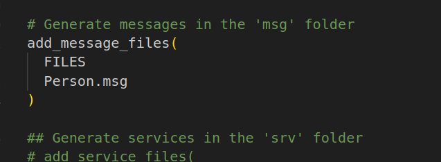

# ROS命令

## 文件系统操作命令

## 1.增加

catkin_create_pkg 自定义包名 依赖包 === 创建新的ROS功能包

sudo apt install xxx === 安装 ROS功能包

## 2.删除

sudo apt purge xxx  ==== 删除某个功能包

rospack find 包名 === 查找某个功能包是否存在，如果存在返回安装路径

roscd 包名 === 进入某个功能包

rosls 包名 === 列出某个包下的文件

apt search xxx === 搜索某个功能包

## 3.查找

rospack list === 列出所有功能包

## 4.修改

rosed 包名 文件名 === 修改功能包文件

需要安装 vim

**比如:**rosed turtlesim Color.msg

## 5.执行

### 5.1 roscore

**roscore ===** 是 ROS 的系统先决条件节点和程序的集合， 必须运行 roscore 才能使 ROS 节点进行通信。

roscore将启动：

- ros master
- ros 参数服务器
- rosout 日志节点


### 5.2 rosrun

**rosrun 包名 可执行文件名**  === 运行指定的ROS节点

**比如:**`rosrun turtlesim turtlesim_node`


### 5.3 roslaunch

**roslaunch 包名 launch文件名** === 执行某个包下的 launch 文件


# 话题通信

## 应用场景

复杂数据的实时传输与交互，例如雷达不断实时更新数据从而计算底盘的运动轨迹

## 模型


### 角色

1.master --->管理者（媒婆）

2.talker   --->发布者（男方）

3.listener --->订阅者（女方）

### 流程

master可以根据话题建立发布者与订阅者之间的连接

### 注意

1.使用的协议有RPC和TCP；

2.步骤0和步骤1没有顺序关系

3.talker和listener都可以存在多个

4.talker和listener建立连接以后，master就可以关闭了

5.上述实现流程以及封装好了，以后直接调用即可


## 发布方代码实现流程

1.包含头文件；

ROS中文本类型 --->std_msgs/String.h（字符串）

2.初始化ROS节点；ros::init()

3.创建节点句柄；ros::NodeHandle

4.创建发布者对象；ros::Publisher

5.编写发布逻辑并发布数据；


## 注意

CmakeLists中的find_package可以看作是编译时的依赖包

catkin_package可以看作是运行时的依赖包


## 订阅方代码实现流程

​    1.包含头文件

​    \#include "plumbing_pubsub/Person.h"

​    2.ROS节点初始化

​    3.创建节点句柄

​    4.创建订阅者对象

句柄名称.subscribe<范型>("话题",消息队列,回调函数名称)；

范型：包含头文件下消息的类型

例：

```c++
subscribe<plumbing_pubsub::Person>("ren",10,doPerson);
```

​    5.编写回调函数，处理订阅的数据

回调函数类似于条件函数，需要外部条件才能触发运行，也跟定时器中断的中断函数差不多

生动形象的比喻：地雷埋在土里，要别人踩才会爆

void 回调函数名称(const 主功能包名称::自定义msg包名称::ConstPtr& 发布函数中的发布者名称)

ConstPtr&是常量指针的引用

例：

```c++
void doPerson(const plumbing_pubsub::Person::ConstPtr& person)
```

​    6.调用spin()函数


## 自定义话题通信消息载体msg

当需要传输复杂的数据，即雷达探测的角度、位置、扫描范围等信息时，需要自定义msg消息类型。msg类似于结构体，里面可以存放多种类型的数据，例如：

- int8, int16, int32, int64 (或者无符号类型: uint*)

- float32, float64

- string

- time, duration

- other msg files

- variable-length array[] and fixed-length array[C]

  ROS中还有一种特殊类型：Header，标头包含时间戳（消息被发布那一刻的时间值）和ROS中常用的坐标帧信息。会经常看到msg文件的第一行具有Header。


## 配置

### CMakeLists.txt

1.find_package

代码编译时的依赖包


2.add_message_files

将创建的msg文件添加上去



3.generate_messages

msg下各类型数据都依赖于std_msgs


4.catkin_package

代码运行时的依赖


5.add_executable

想要编译成功就必须添加，第一个为节点的代称，可以与功能包下对应项目代码的名称相同。

第二个就是功能包下的项目代码名


6.add_dependencies

凡是用到msg文件的项目代码，都要添加msg生成的依赖


7.target_link_libraries

选取一个可用的库与目标代码形成连接


### package.xml

msg文件记得添加message_generation、message_runtime依赖


# 服务通信

## 应用场景

概念：以请求响应实现不同节点之间的数据交互的通信模式

用于偶然的、对实时性有要求、有一定处理逻辑的数据传输场景，例如巡逻机器人控制系统分析传感器数据发现可疑物体，向相机请求拍照。类似于一方请求，另一方应答。

即A请求一次，B响应一次

## 模型


### 角色

1.master --->管理者（114平台）

2.server  --->服务端（服务公司）

3.client   --->客户端（我）

### 流程

master同样可以根据话题连接服务端和客户端

### 注意

1.保证顺序，当客户端发起请求时，服务端要已经启动；

2.客户端和服务端可以存在多个

3.模型所示的流程均已封装好，可以直接调用

4.客户端和服务端的话题要一致

5.服务端和客户端通信信息的数据载体要自定义

## 自定义服务通信消息载体srv

srv文件内可用的数据类型与msg一致，且定义srv实现流程与自定义msg类似

例：

#客户端请求时发送的两个数据

int32 num1

int32 num2

\---

\#服务响应时发送的数据

int32 sum

**中间的三个负号是分割客户端与服务端数据的分割线，必须要有**

## 服务端代码实现流程

服务端实现：解析客户端提交的数据，并运算再产生响应

1.包含头文件；

```c++
#include "plumbing_server_client/Addints.h"
```

2.初始化ROS节点；

3.创建节点句柄；

4.创建一个服务对象

```c++
ros::ServiceServer server = nh.advertiseService("addInts",doNums);

```

5.处理请求并产生响应

&request和&response应该都是结构体指针？

```c++
bool doNums(plumbing_server_client::Addints::Request &request,
            plumbing_server_client::Addints::Response &response)
{
    //1.处理请求
    int num1;
    int num2;
    num1 = request.num1;
    num2 = request.num2;
    ROS_INFO("收到数据:num1 = %d,num2 = %d",num1,num2);
    //2.组织响应
    int sum;
    sum = num1+num2;
    response.sum = sum;
    ROS_INFO("求和结果:sum = %d",sum);
    return true;
}
```

**一定要注意给srv结构体的数据赋值，否则客户端响应的结果将为零。response.sum = sum**

6.回调函数spin()

## 客户端代码实现流程

客户端：提交两个整数，并处理响应的结果

1.包含头文件；

2.初始化ROS节点；

3.创建节点句柄；

4.创建一个客户端对象；

```c++
ros::ServiceClient client = nh.serviceClient<plumbing_server_client::Addints>("addInts");

```

5.提交请求并处理响应；

命名独立的消息结构体

```c++
plumbing_server_client::Addints ai;
```

5.1组织请求

```c++
ai.request.num1=100;

ai.request.num2=200;
```

5.2请求响应

```c++
    bool flag = client.call(ai);
    if(flag)
    {
        ROS_INFO("响应成功");
        ROS_INFO("响应结果 = %d",ai.response.sum);
    }
    else
    {
        ROS_INFO("处理失败");
    }
```

实现参数的动态提交：

1.格式：rosrun xxxxx xxxxx 12 34

2.节点执行时，需要获取命令中的参数，并组织进request


问题：

如果先启动客户端，那么会请求异常

需求：

如果先启动客户端，不要直接抛出异常，而是挂起，等服务器启动后，再正常请求响应

解决：

在ROS中内置了相关函数，这些函数可以让客户端启动后挂起，等待服务器启动

有两个函数可以解决：

1.client.waitForExistence();

```c++
client.waitForExistence();
```

2.ros::service::waitForService("服务话题");

```c++
ros::service::waitForService("服务话题");
```

并且要注意，放置该函数的位置不能是在调用了服务端代码的中间，必须放在调用服务端之前

 5.1组织请求

```c++
ai.request.num1=atoi(argv[1]);
ai.request.num2=atoi(argv[2]);
```

**第一个参数argv[0]一定是程序的名词，并且包含了程序所在的完整路径**

所以确切的说，需要我们输入的main函数参数应该是**argc-1**个

## 配置

### CMakeLists.txt

1.find_package

编译时的依赖包


2.add_service_files

srv文件都要添加进去


# 参数服务器

## 应用场景

概念：以共享的方式实现不同节点之间数据的交互的通信模式，参数服务器相当于是独立于所有节点的公共容器，可以将数据存储在该容器中，被不同的节点调用。不同的节点也可以往其中存储、修改、删除、查找数据。

例：导航实现时，会进行路径规划，比如**全局规划**，设计一个从出发点到目标点的大致路径。**局部规划**，会根据当前路况生成实时的行进路径。路径规划时，我们可以将这些**尺寸信息存储到参数服务器**，全局路径规划节点与局部路径规划节点都可以从参数服务器中调用这些参数。

## 模型


### 角色

1.ROS Master（管理者）

2.Talker（参数设置者）

3.Listener（参数调用者）

ROS Master作为一个公共容器保存参数，Talker可以向容器中设置参数，Listener可以获取参数。

### 流程

1.Talker 通过 RPC 向参数服务器发送参数(包括参数名与参数值)，ROS Master 将参数保存到参数列表中。

2.Listener通过RPC向参数服务器发送参数查找请求，请求中包含要查找的参数名。

3.ROS Master 根据步骤2请求提供的参数名查找参数值，并将查询结果通过RPC发送给Listener。

### 注意

参数可使用数据类型：

32-bit integers （4 byte int）

booleans （bool类型）

strings

doubles

iso8601 dates

lists

字典

**参数服务器不是为了高性能而设计的，因此最好用于存储静态的非二进制的简单数据。**

API是应用程序编程“接口”，即已封装好一系列函数，提供函数接口给你用

## 参数服务器设置与修改参数

需要实现参数的新增与修改

需求：首先设置机器人的共享参数，类型，半径

​      再修改半径（0.2m）

实现：

ros::NodeHandle

```c++
setParam(“键值”，值)；
```

ros::param

```c++
set(“键值”，值);
```

修改，只需要继续调研setParam或set函数，保证键值是已经存在的，

那么之前的值会被覆盖

1.初始化ROS节点

ros::init(argc,argv,"set_param_c");

2.创建ROS节点句柄

ros::NodeHandle nh;

3.参数增--------------------------

 方案1：nh

```c++
nh.setParam("type","xiaoHuang");//第一个参数为键值，名称不能重复

nh.setParam("radius",0.15);
```

  方案2：ros::param

```c++
ros::param::set("type_param","xiaoBai");
ros::param::set("radius_param",0.3);
```

  4.参数改--------------------------

  方案1：nh  

```c++
nh.setParam("type","laoHuang");
```

  方案2：ros::param

```c++
ros::param::set("type_param","laoBai");
```

## 参数服务器获取参数

演示参数查询

实现：

ros::NodeHandle

  1.param(键,默认值) 

​    效果：若存在，返回对应结果，否则返回默认值。

  2.getParam(键,存储结果的变量)

​    效果：若存在,返回 true,且将值赋值给参数2；

​                若果键不存在，那么返回值为 false，且不为参数2赋值。

  3.getParamCached(键,存储结果的变量)--提高变量获取效率

​     效果：若存在,返回 true,且将值赋值给参数2；

​                 若键不存在，那么返回值为 false，且不为参数2赋值。

  4.getParamNames(std::vector<std::string>)

​      效果：获取所有的键,并存储在参数 vector 中 。

  5.hasParam(键)

​      效果：是否包含某个键，存在返回 true，否则返回 false。

  6.searchParam(参数1，参数2)

​      效果：搜索键，参数1是被搜索的键，参数2存储搜索结果的变量。

ros::param

## 参数服务器删除参数

演示参数消除

实现;

ros::NodeHandle

```c++
bool flag1 = nh.deleteParam(“键值”)；//返还true或false
```

ros::param

```c++
bool flag2 = ros::param::del(“键值”);//返还true或false
```

